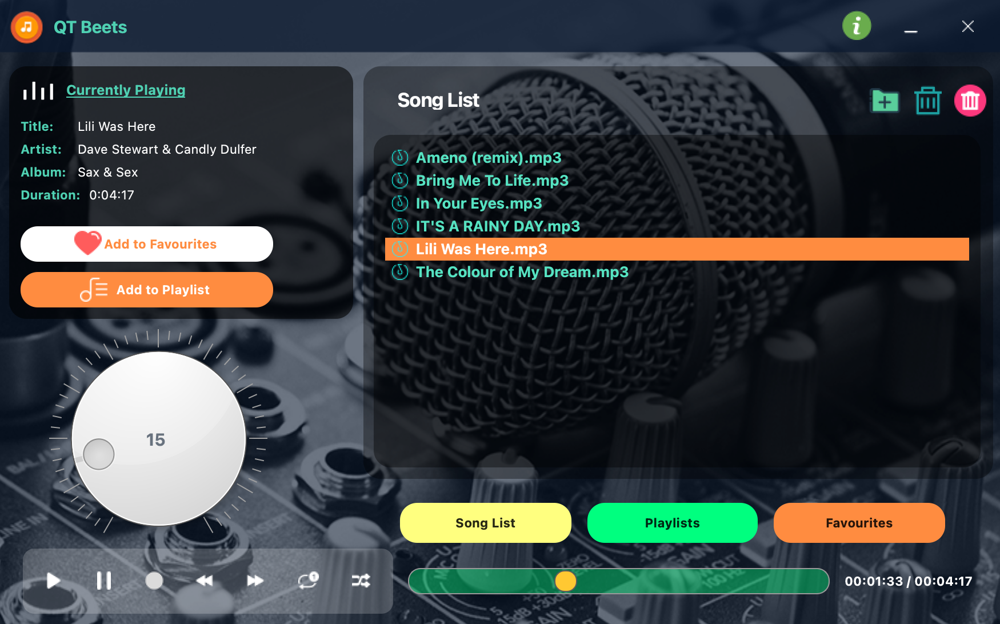

# Modern Music Player

## 1. Project Overview

This is a desktop music player application built with PyQt5, designed for a modern and flexible user experience. The codebase is split into modules managing the UI, database, event handling, and audio playback. It uses a modular architecture with dependency injection to simplify testing and maintenance. Key design patterns include Factory, Command, Strategy, and Dependency Injection. Current version: 1.4.

### Try Out the Latest Build

#### macOS users

- Download the build artifact from [the latest Build macOS App workflow](https://github.com/harley029/PyQt_Advanced_Music_Player/actions/workflows/ci.yml) in the **Artifacts** section.
- Unpack the `.zip` file into a separate folder.
- Open Terminal in that folder.
- Run the following command to bypass Gatekeeper: `xattr -d com.apple.quarantine qtbeets-1.4.app`.
- Open and enjoy the fully functional application `QtBeets`.

#### Windows users

- Download the build artifact from [the latest Build Windows App workflow](https://github.com/harley029/PyQt_Advanced_Music_Player/actions/workflows/ci_win.yml) in the **Artifacts** section.
- Unpack the `.zip` file into a separate folder.
- Open and enjoy the fully functional application `QtBeets`.

## 2. Module Breakdown

### 2.1. Main UI (`QtBeets.py`)

Initializes the core components, sets up the main window, and manages UI events using `WindowManager`, `UIUpdater`, and `EventHandler`.

### 2.2. Database Module (`db_manager.py` & `db_utils.py`)

Handles SQLite database operations: connections, queries, table creation, and data management. Includes utilities for table name validation.

### 2.3. Controllers

#### 2.3.1. `MusicPlayerController`

Manages playback (play, pause, stop, volume) via `QMediaPlayer`.

#### 2.3.2. `UIUpdater`

Keeps the UI in sync with playback state (e.g., slider, time labels, song metadata).

#### 2.3.3. `EventHandler`

Coordinates user actions, delegating to handlers like `PlaybackHandler`, `NavigationHandler`, and `UIEventHandler`.

#### 2.3.4. Utility Modules

Shared tools for messaging (`MessageManager`), UI access (`UIProvider`), and list operations (`ListManager`).

#### 2.3.5. Command & Context Menu Modules

Encapsulate user actions as commands for decoupled and extensible UI interactions.

## 3. SOLID Principles Analysis

- **Single Responsibility Principle (SRP)**: Each class has one job—e.g., `UIUpdater` updates the UI, `MusicPlayerController` handles playback.
- **Open/Closed Principle (OCP)**: Extensible via dependency injection and interfaces, minimizing changes to existing code.
- **Liskov Substitution Principle (LSP)**: Interfaces like `IMusicPlayerController` and `IUIProvider` allow seamless substitution.
- **Interface Segregation Principle (ISP)**: Focused interfaces ensure classes implement only relevant methods.
- **Dependency Inversion Principle (DIP)**: High-level modules rely on abstractions, with dependencies injected via configs (e.g., `EventHandlerConfig`).

## 4. DRY Principle Analysis

- **Avoiding Repetition**: Shared logic lives in utility classes (`UIProvider`, `ListManager`, `MessageManager`), reducing duplication.
- **Shared Methods**: Common tasks (e.g., list validation, message display) are centralized for consistency and ease of maintenance.

## 5. Structural Programming Patterns

- **Factory Pattern**: `AppFactory` centralizes dependency creation and setup.
- **Command Pattern**: User actions (e.g., `PlayCommand`, `PauseCommand`) are encapsulated for decoupling.
- **Strategy Pattern**: `NavigationHandler` switches navigation behaviors (normal, random, looping) at runtime.
- **Dependency Injection**: Configs like `EventHandlerConfig` inject dependencies for loose coupling.

## 6. How to build on the local computer

- **install:** cx_Freeze: `pip install cx_Freeze`
- **install dependencies:** `pip install -r requirements.txt`
- **build (macOS users):** `python build.py bdist_mac`
- **build (macOS users):** `python setup.py build`
- find a `qtbeets-1.4` application in the `build` folder.
